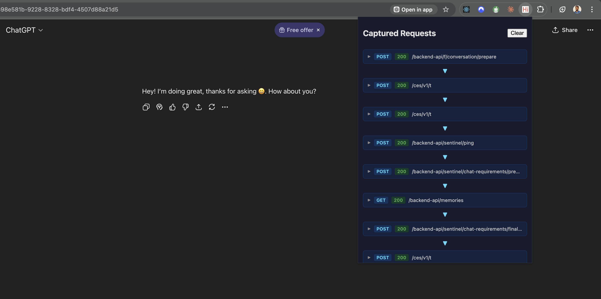

# AgentTrace

> **Work in Progress** — This project is actively being developed. Features are being added incrementally. Contributions and feedback are welcome!

A Chrome extension that intercepts AI API calls, letting you inspect and debug agent conversations in the browser.

## What It Does



- Intercepts network requests to ChatGPT (`chatgpt.com`)
- Displays request method, status code, and URL path
- Expandable detail view for each request (IP, cache status, timestamp, and more)
- Clear button to reset captured data

## Example

Send a single message in ChatGPT and AgentTrace reveals the **15+ API calls** happening behind the scenes — preparation, security checks, telemetry, the actual AI call, and post-processing metrics.

## Install

1. Clone this repo
   ```bash
   git clone https://github.com/Tresor11/agent-trace.git
   ```
2. Go to `chrome://extensions/`
3. Enable **Developer mode** (toggle in top right)
4. Click **Load unpacked** and select the cloned folder, you can follow the [instructions here](https://developer.chrome.com/docs/extensions/get-started/tutorial/hello-world#load-unpacked) 

## How It Works

- **background.js** — Service worker that listens for completed network requests to `chatgpt.com` using the `chrome.webRequest` API, and stores them in `chrome.storage.local`
- **popup.js** — Reads captured requests from storage and renders them as collapsible list items
- **popup.html / popup.css** — Dark-themed UI with status indicators and expandable request details

## Roadmap

### Coming Next
- [ ] **Request/Response Bodies** — Capture and display the full payload of each API call, not just metadata
- [ ] **Agent Loop Visualization** — Identify and visualize the plan → act → observe cycle in agent conversations

### Planned
- [ ] **Multi-Provider Support** — Extend interception to Anthropic (Claude), Gemini, and other AI APIs
- [ ] **Request Replay** — Modify and resend intercepted requests to test different inputs
- [ ] **Conversation Export** — Export full conversation threads as JSON for offline analysis
- [ ] **Filter & Search** — Filter captured requests by type (e.g. hide telemetry, show only AI calls)

## Contributing

Contributions are welcome! Feel free to open issues or submit PRs.

## License

[MIT](LICENSE)
